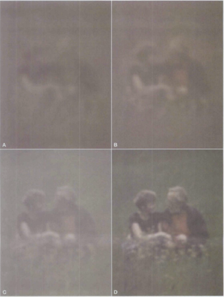
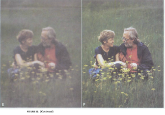
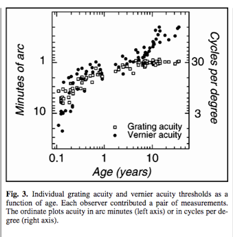
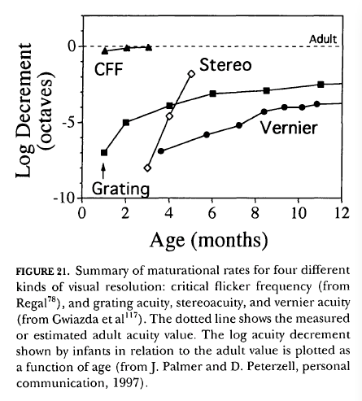
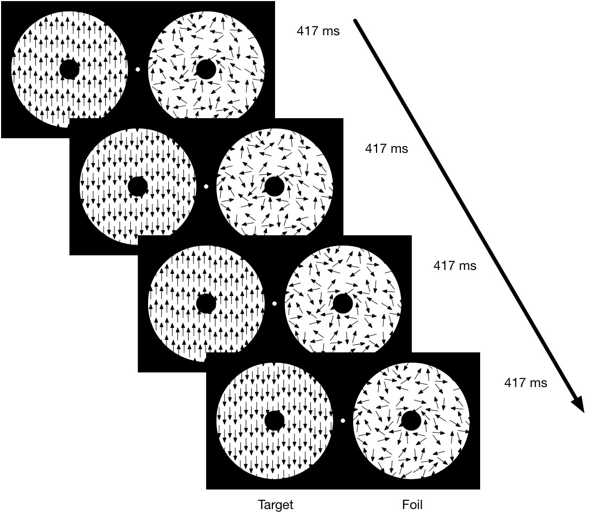
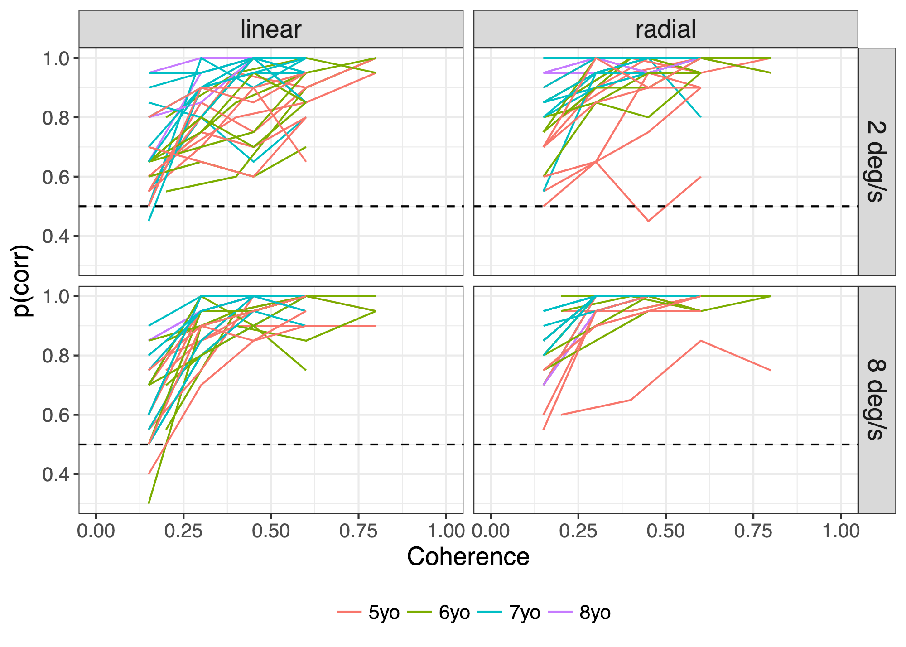

# Preliminaries

## Agenda

- Vision and its development
- Behavior in psychology and neuroscience
- Toward a cumulative psychological science
- Wrap-up

## Themes

- Psychology is a science of behavior and internal states
    - Some are more easily measured than others
- Psychology is harder than physics
- But will progress slowly unless...
    - we commit to practices that make our theories clear and our findings cumulative

# Vision and its development

## What is perception for?

## What is vision for?

- Perceiving events
    - What
    - Where
    - When
- Guiding action

## Properties of light

- Electromagnetic radiation
    - Wavelength/frequency
    - Intensity
    
---


## Properties of light

- Propagates quickly over long distances
- Some entities emit light
- But more refract, reflect, or absorb

---


---

<p><a href="https://commons.wikimedia.org/wiki/File:Pencil_in_a_bowl_of_water.svg#/media/File:Pencil_in_a_bowl_of_water.svg"></a><br>By <a href="//commons.wikimedia.org/wiki/File:Pencil_in_a_bowl_of_water.png" title="File:Pencil in a bowl of water.png">Pencil_in_a_bowl_of_water.png</a>: <a href="//commons.wikimedia.org/wiki/User:Theresa_knott" title="User:Theresa knott">User:Theresa_knott</a>
derivative work: <a href="//commons.wikimedia.org/wiki/User:Gregors" title="User:Gregors">Gregors</a> (<a href="//commons.wikimedia.org/wiki/User_talk:Gregors" title="User talk:Gregors"><span class="signature-talk">talk</span></a>) 10:51, 23 February 2011 (UTC) - <a href="//commons.wikimedia.org/wiki/File:Pencil_in_a_bowl_of_water.png" title="File:Pencil in a bowl of water.png">Pencil_in_a_bowl_of_water.png</a>, <a href="http://creativecommons.org/licenses/by-sa/3.0/" title="Creative Commons Attribution-Share Alike 3.0">CC BY-SA 3.0</a>, <a href="https://commons.wikimedia.org/w/index.php?curid=13712912">Link</a></p>

---


## Structure of optic array


## Plenoptic function

<p><a href="https://commons.wikimedia.org/wiki/File:Plenoptic_function_b.svg#/media/File:Plenoptic_function_b.svg"></a><br>By <a href="//commons.wikimedia.org/wiki/User:Qef" title="User:Qef">Qef</a> - Own work by uploader, designed to replace original bitmap <a href="https://en.wikipedia.org/wiki/Image:Plenoptic-function-b.png" class="extiw" title="en:Image:Plenoptic-function-b.png">en:Image:Plenoptic-function-b.png</a>, but with clearer labeling., Public Domain, <a href="https://commons.wikimedia.org/w/index.php?curid=4353407">Link</a></p>

## Goal of vision science

- How do observers detect...
    - Object properties (shape, size, object type, color, surface properties)
    - Object positions and motions
    - Geometric layout of the environment
- How does vision guide action?

## Vision develops!



---



## Acuity (spatial vision)


---



## Contrast sensitivity


---


## Orientation


## Putting it all together



## Optic flow

- Patterned visual motion corresponding observer (or object) motion through space

---

<video controls>
  <source src="https://nyu.databrary.org/slot/9803/-/asset/11171/download?inline=true" type="video/mp4">
Your browser does not support the video tag.
</video>

Gilmore, R.O. (2014). Four-month-olds' discrimination of optic flow patterns depicting different directions of observer motion. Databrary. Retrieved February 8, 2019 from http://doi.org/10.17910/B7Z593

## Optic flow sensitivity develops throughout childhood



---



Gilmore, R.O. (2016). Motion Coherence Thresholds for Child Participants Viewing Linear and Radial Patterns of Optic Flow. Databrary. Retrieved February 8, 2019 from https://nyu.databrary.org/volume/218

---


Gilmore, R.O. (2016). Motion Coherence Thresholds for Child Participants Viewing Linear and Radial Patterns of Optic Flow. Databrary. Retrieved February 8, 2019 from https://nyu.databrary.org/volume/218

## Brain responses do, too...


Gilmore, R. O., Thomas, A. L., & Fesi, J. (2016). Children’s brain responses to optic flow vary by pattern type and motion speed. *PloS One*, *11*(6), e0157911. journals.plos.org. Retrieved September 20, 2016, from http://journals.plos.org/plosone/article?id=10.1371/journal.pone.0157911

---


## 'Causes' of developmental changes in optic flow sensitivity

- Brain development (specific to vision, general to perception/cognition)
- Behavioral changes
- Body posture, size

---

>"For me, one of the major attractions of visual science is the promise it holds for empirical attacks on the mind-body problem—that is, for working out meaningful ways to explain psychophysically defined visual functions on the basis of properties of the neural substrate. A critical locus or critical computation for a particular perceptual function can be defined as an anatomic or computational stage at which information concerning that function is lost or importantly reorganized; or more poetically, as a stage or computation that leaves its mark on that perceptual capacity."

---

>"Part of the appeal of visual development is its potential for extending this promise. Visual functions mature because the visual substrate matures, and the causes of functional maturation undoubtedly lie in neural maturation. But the length of the big toe matures too, and we do not see it as causal in relation to the development of grating acuity. The puzzle is, which of the many immaturities of the visual substrate provide the critical immaturities that limit a particular visual capacity at a particular age?"

## Questions

- What are the *perceptual* requirements for the behaviors (or internal states) you study?
- What is the developmental trajectory for the behaviors (or internal states) you study?

# Behavior in psychology and neuroscience

## What is behavior, anyway?

<a href="http://dx.doi.org/10.1016/j.anbehav.2009.03.018">

</a>

## A spider builds a web

- Behavior
- Not behavior
- Don't know

## A rabbit grows thicker fur in the winter

- Behavior
- Not behavior
- Don't know


## Others

- a dog salivates in anticipation of feeding time
- a person decides not to do anything tomorrow if it rains
- ~~a cat produces insulin because of excess sugar in her blood~~
- ~~a person's heart beats harder after a nightmare~~
- *a plant bends its leaves toward a light source*
- *a rat has a dislike for salty food*
- *ants that are physiologically capable of laying eggs do not do so because they are not queens.*

---

<div class="centered">

</div>

---

<div class="centered">

</div>

---

<div class="centered">

</div>

---

<div class="centered">

</div>

---

<div class="centered">

</div>

## Questions

- What behaviors are critical for humans to perform?
- What behaviors are critical for humans to perform in the topics you study?
- Does neuroscience need behavior?
- Does psychology

# Toward a cumulative psychological science

# Imagine

## ...meta-analyses from your desktop

---

<video width="900" controls data-autoplay>
  <source src="mov/neurosynth-happy.mp4" type="video/mp4">
Your browser does not support the video tag.
</video>
</br>
<http://neurosynth.org>

## ...visualization of task data accumulated across studies & labs

---

<video width="900" controls data-autoplay>
  <source src="mov/wordbank-vocabulary.mp4" type="video/mp4">
Your browser does not support the video tag.
</video>
</br>
<http://wordbank.stanford.edu>

## ...machine-learning-assisted analysis

---

<video height="600" controls data-autoplay>
  <source src="mov/Construction.mp4" type="video/mp4">
Your browser does not support the video tag.
</video>

*Source*: Ori Ossmy (NYU)

## ..."scriptable" analyses and visualizations from centrally stored & shared data

---

<video width="900" controls data-autoplay>
  <source src="mov/summarize_demog.mp4" type="video/mp4">
</video>
</br>
<http://github.com/PLAY-behaviorome/databraryapi>

## ...easy downloading and reuse of others' materials

---


</br>
<audio controls data-autoplay>
  <source src="https://nyu.databrary.org/slot/12213/0,15046/asset/46757/download?inline=true" type="audio/mpeg">
Your browser does not support the audio element.
</audio>
<audio controls>
  <source src="https://nyu.databrary.org/slot/12212/0,15046/asset/46748/download?inline=true" type="audio/mpeg">
Your browser does not support the audio element.
</audio>
</br>
</br>
Cole, P.M., Gilmore, R.O., Scherf, K.S. & Perez-Edgar, K. (2016). The Proximal Emotional Environment Project (PEEP). Databrary. http://doi.org/10.17910/B7.248.

## ...reproduction of others' procedures through video protocols

---

<video width="800" controls data-autoplay>
  <source src="https://nyu.databrary.org/slot/14765/0,79273/asset/64898/download?inline=true" type="video/mp4">
Your browser does not support the video tag.
</video>

The PLAY Project Wiki: <https://dev1.ed-projects.nyu.edu/wikis/docuwiki/doku.php/landing>

## ...A cumulative psychological science

<a href="https://www.psychologicalscience.org/observer/becoming-a-cumulative-science">

</a>

## Where

- Findings accumulate
- Theories are advanced, accepted, expanded, or rejected
- Phenomena become increasingly predictable
- Discovery accelerates

# Barriers

## Psychological science is harder than physics

---


---


## Studies are underpowered

---

<div class="centered">


<small>([Szucs & Ioannides, 2017](http://doi.org/10.1371/journal.pbio.2000797))</small>
</div>

<div class="notes">
As Szucs and Ioannides have shown based on an analysis of more than 10,000 papers in the cognitive neuroscience literature, sample sizes are small, and the probability of false negatives is high, especially for small to medium effect sizes.
</div>

---

<div class="centered">
> "Assuming a realistic range of prior probabilities for null hypotheses, false report probability is likely to exceed 50% for the whole literature."

<small>([Szucs & Ioannides, 2017](http://doi.org/10.1371/journal.pbio.2000797))</small>
</div>

## Published papers have errors

---

<div class="centered">
<a href="http://doi.org/10.3758/s13428-015-0664-2)">

</a>
</div>

---

<div class="centered">

</div>

<small>([Nuijten et al., 2015](http://doi.org/10.3758/s13428-015-0664-2))</small>

<div class="notes">
Statistical reporting errors in the published literature are more common that many might think.
</div>

## Confusion about data ownership

- Institutions
- Taxpayers
- Researchers
- Participants

## Eagerly share findings but not data or materials

---

<div class="centered">


<small>([Wicherts et al., 2006](http://doi.org/10.1037/0003-066X.61.7.726))</small>
</div>

## Blinded from seeing the whole elephant

---


## Fall victim to the toothbrush problem (Mischel, 2009)

---

> "*...psychologists tend to treat other peoples’ theories like toothbrushes; no self-respecting individual wants to use anyone else’s.*"

---

> "*The toothbrush culture undermines the building of a genuinely cumulative science, encouraging more parallel play and solo game playing, rather than building on each other’s directly relevant best work.*"

# Solutions

## Mischel 2009

- Common tools
- Robust, replicable, consequential findings
- Boundary crossing and bridge building
    
## Make open data & materials sharing 

## ...the norm not the exception

## Plan for sharing

- From the earliest stages
- Data Management Plans (NSF and NIH proposals)
- Data as a "first order" research product

## What to share

- Data
    - & analysis code/scripts (R, Python, SPSS, SAS, ...)
    - Rawest possible (trial-level, individual, ...)
- Displays (& code to generate)
- Protocols & procedures
    - Video as gold standard

---

<div class="centered">
<a href="http://www.apa.org/science/about/psa/2017/10/video-data.aspx">

</div>

---

<a href="https://dev1.ed-projects.nyu.edu/wikis/docuwiki">

</a>

The PLAY Project Wiki: <https://dev1.ed-projects.nyu.edu/wikis/docuwiki/doku.php/landing>

## Where to share

- Data repository
    - [ICPSR](https://www.icpsr.umich.edu/), [Dataverse](http://dataverse.org), [OSF](https://osf.io), [Dryad](https://) (domain/measure general)
    - [Databrary](https://databrary.org) (behavioral science; video/audio ++)
    - [OpenNeuro](https://openneuro.org), [TalkBank](https://talkbank.org), [WordBank](http://wordbank.stanford.edu/) (measure-specific)
- Supplemental material with article
- Data paper (e.g. *Nature Scientific Data*)
- Institutional repository

## With whom

- Public
    - Risk of reidentification
    - Can you really anonymize?
- Researchers
    - ICPSR, Databrary, & OpenNeuro
- People you select & vet

## When 

- Soon after you collect it
- On manuscript submission
- On acceptance or publication
- End of grant
- ~~When I'm damn good and ready...~~

## How

- "FAIRly"
- **F**indable, **A**ccesible, **I**nteroperable, and **R**eusable [(Wilkinson et al., 2016)](http://dx.doi.org/10.1038/sdata.2016.18)
    - Easier to find in repository
    - Interoperable formats
    - Codebooks

## Ethically

- Ask permission to share (especially for sensitive, identifiable data)
    - Use template language
    - [(Gilmore & Nilsonne, 2017)](https://osf.io/9d5hr/)
- Don't promise to destroy data (but GDPR?)
- Don't unduly restrict future reuses

---

>"*the principles of human subject research require an analysis of both risks and benefits...such an analysis suggests that researchers may have a positive duty to share data in order to maximize the contribution that individual participants have made.*"

<small>([Brakewood & Poldack, 2013](http://dx.doi.org/10.1016/j.neuroimage.2013.02.040))</small>

## Openly

- Without restriction on others' reuse
- Without *quid pro quo*, pre-approval, or requirement of co-authorship
- *With* expectation of ethical use **AND** proper citation

## Questions

- What barriers exist to making research in your domain more cumulative?

# Wrap-up

# Things I'm working on

- What are the statistics of natural visual (sensory) experiences?
- Human behaviorome: [Play & Learning Across a Year (PLAY) project](https://nyu.databrary.org/volume/444)
- Tools for cumulative psychological science: AI/computer vision, [R](https://github.com/PLAY-behaviorome/databraryapi)/[Python](https://github.com/PLAY-behaviorome/databrarypy) packages to interact with [Databrary](http://databrary.org), [Datavyu](http://datavyu.org)

---

This talk was produced on `r Sys.time()` in [RStudio 1.1.453](http://rstudio.com) using R Markdown and the reveal.JS framework.
The code and materials used to generate the slides may be found at <https://github.com/psu-psychology/psy-524-cognitive-prosem-2019/524-2019-02-11-gilmore.html/>. 
Information about the R Session that produced the slides is as follows:

---

```{r session-info}
sessionInfo()
```
